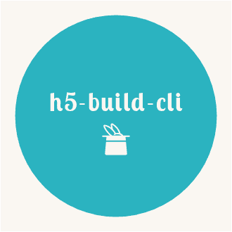

# H5模板构建工具

<p align="center">



</p>

### 命令

```bash
$ npx h5-build-cli init -t NyPhile/h5_template
# node版本大于5.2
# 参数可在命令行输入，也可以输入命令后按交互提示输入
```

### 参数

以下参数均可交互式输入

```bash
-n or --name
# 项目名称，必须
# 用于替换模板项目中package.json的{name}

-c or --channel
# 频道名称，必须
# 用于替换模板项目内上传路径中的频道路径

-d or --desc
# 项目描述，可选
# 用于替换模板项目中package.json的{description}

-t or --template
# 模板地址，必选
# 使用download-git-repo下载模板
# H5模板地址 NyPhile/h5_template

--username
# 上传工具账号，必须，即邮箱前缀

--password
# 上传工具密码，必须，即邮箱密码
```